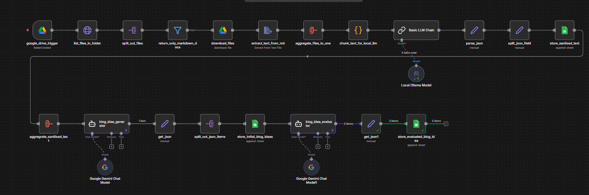

## Blog Generator Workflow created via N8N.
1. Setup **n8n** locally following the documentation available [here](https://docs.n8n.io/hosting/installation/docker/).
2. Then create a docker network using `docker network create ai-blog-net` to be shared by the workflow and ollama docker.
3. Add the **ai-blog-net** network to the ollama docker compose file, as well as the n8n docker file.
4. Can change the local model downloaded from ollama via:
    - `OLLAMA_MODEL=llama3.1` in the enviroment key.

### Workflow Diagram


### Nodes used
- Google drive trigger
- HTTP request
- Split out
- Google drive download files
- Extract from text files
- Aggregate
- Python custom script
- Basic LLM chain connected to a locally hosted Ollama model
- Spreadsheet to locally sanitised text
- AI agent using Google gemini chat model to generate blog topics
  - Output json indicator 
    ```JSON
        {
            "blog_idea": "",
            "keywords": [],
            "search_intent": "",
            "justification_summary": "",
            "strength_of_idea": ""
        }           
    ```
- Json parser 
- Another Spreadsheet to store initial blog topics.

